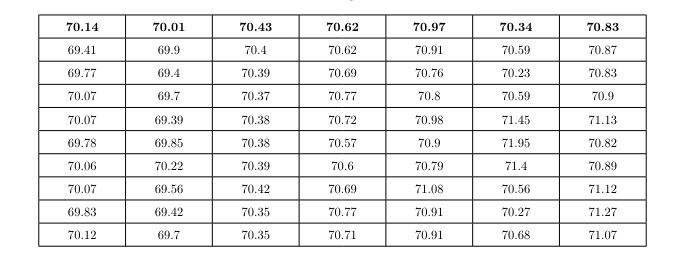

# Setup

## Pre-requirements

- Linux system (tested on Arch and Fedora)
- LibreOffice Calc
- xclip

## Installation

do this replacing `$HOME/git` with your preffered directory to clone git projects:

```sh
export MyGitFolder="$HOME/git"
export MyBinFolder="$HOME/bin"
cd $MyGitFolder
git clone https://github.com/gucio321/excel2tex
cd $MyBinFolder
ln -s $MyGitFolder/excel2tex/excel2tex.sh excel2tex
```

:information_source: make sure you have `$HOME/bin` in your `$PATH` variable or change the `$MyBinFolder` to your preffered directory.

# Usage

1. Open LibreOffice Calc
2. Select cells you'd like to put in you latex

3. Run excel2tex script in your terminal (You can specify additional options - see [here](#command-line-arguments)).
4. Paste the output in your latex document and build it. Adjust title if necessary.


## Command Line Arguments

```console
$ excel2tex --help
Usage of excel2tex.sh:

-t, --title:    Set Table's title
                Default: XXXXX
-s, --sep:      Set custom "Table Separator" (aka column type in latex)
                Default is X
                NOTE: You might also want this in your preamble:
                \newcolumntype{L}{>{\raggedright\arraybackslash}X}
                \newcolumntype{Y}{>{\centering\arraybackslash}X}
-y:             Alias to -s Y
-n:             Set number of table columns.
                NOTE: by default uses 1st program argument if no other options specified
                Default: --help
-h, --help:     Show this message and exit.
```

# Legal Notes

:warning: This project is not affiliated with LibreOffice nor Microsoft Excel. It is a personal project made for educational purposes only. Use it at your own risk.

Microsoft and Microsoft Excel is a registered trademark of Microsoft Corporation in the United States and/or other countries.
