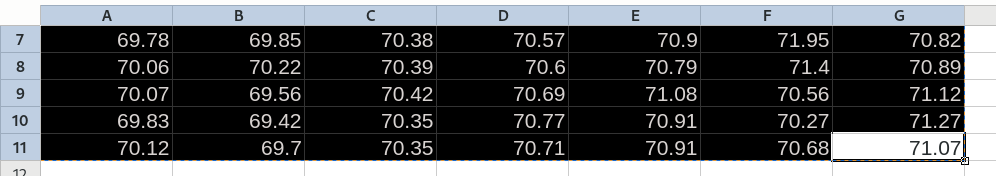

# Installation

Download an executable from Releases section and put somewhere on your system (e.g. inside of $pATH).

Optionally to get latest code do `go install github.com/gucio321/excel2tex/v2@latest`

# Usage

1. Open LibreOffice Calc or Excel
2. Select cells you'd like to put in you latex and Ctrl+C-copy them.

3. Run excel2tex programm in your terminal or by double-click on windows (You can specify additional options - see [here](#command-line-arguments)).
4. Paste the output in your latex document and build it.


## Command Line Arguments

```console
[INFO]:	Welcome to excel2tex v3.0.0
Usage: excel2tex [FLAG]...

Flags:
    -T, --title                 Title of the table                                                                                                                                                   (type: string; default: XXXXX)
    -l, --label                 Label for the table                                                                                                                                                  (type: string)
    -t, --trim                  Trim empty columns (useful if you copy only some specified columns e.g. A and C) (NOTE: considers the first (header) row only!)                                      (type: bool; default: false)
    -nb, --no-header-bold       Do not bold first row (header)                                                                                                                                       (type: bool; default: false)
    -bc, --bold-first-column    Bold first column                                                                                                                                                    (type: bool; default: false)
    -npp, -do --data-only       Do not generate latex preamble and postamble. Will return only tble body. Ignores title, label, column type, table type e.t.c. Useful for introducing data fixes.    (type: bool; default: false)
    -s                          Separator for table columns (latex table columns type)                                                                                                               (type: string; default: c)
    -legacy                     Use tabularx instead of longtable. (-s X recomended)                                                                                                                 (type: bool; default: false)
    -f, --force                 Skip any data checks (when possible).                                                                                                                                (type: bool; default: false)
    -v, --version               Print version and exit                                                                                                                                               (type: bool; default: false)
    -h, --help                  show help                                                                                                                                                            (type: bool)

```

# Legal Notes

:warning: This project is not affiliated with LibreOffice nor Microsoft Excel. It is a personal project made for educational purposes only. Use it at your own risk.

Excel is a registered trademark of Microsoft Corporation in the United States and/or other countries.
